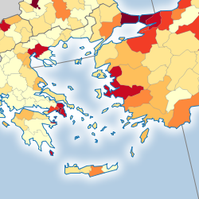
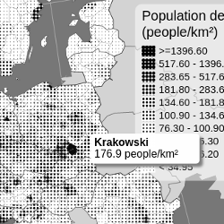
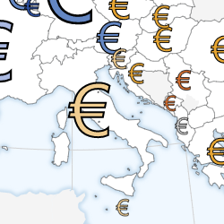
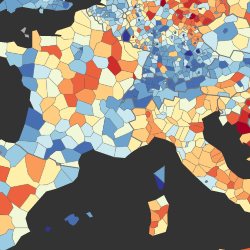
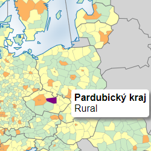

# eurostat-map.js

Reusable library to quickly create and customise web maps showing [Eurostat](https://ec.europa.eu/eurostat) data directly retrieved from
[Eurostat database](https://ec.europa.eu/eurostat/data/database).

[](https://bl.ocks.org/jgaffuri/raw/0d6e1b1c6f9e1297829f38b9c37737fe/)
[](https://bl.ocks.org/jgaffuri/raw/c8b99b207bb80a923bf1fd19f5d6de7e/)
[](https://bl.ocks.org/jgaffuri/raw/cf5f187bd195f9c8771a1a3a4898079a/)
[](https://bl.ocks.org/jgaffuri/raw/e10d3e5540bbf89ee572030f1b13b8e6/)
[](https://bl.ocks.org/jgaffuri/raw/6bff324484f404c3e09cc2408a3e5265/)

## Some examples

* [Population density map](https://bl.ocks.org/jgaffuri/raw/0d6e1b1c6f9e1297829f38b9c37737fe/) (see [the code](https://bl.ocks.org/jgaffuri/0d6e1b1c6f9e1297829f38b9c37737fe))
* [Population density map with dot pattern](https://bl.ocks.org/jgaffuri/raw/c8b99b207bb80a923bf1fd19f5d6de7e/) (see [the code](https://bl.ocks.org/jgaffuri/c8b99b207bb80a923bf1fd19f5d6de7e))
* [Population map with proportional circles](https://bl.ocks.org/jgaffuri/raw/cf5f187bd195f9c8771a1a3a4898079a/) (see [the code](https://bl.ocks.org/jgaffuri/cf5f187bd195f9c8771a1a3a4898079a))
* [Population change](https://bl.ocks.org/jgaffuri/raw/e10d3e5540bbf89ee572030f1b13b8e6/) (see [the code](https://bl.ocks.org/jgaffuri/e10d3e5540bbf89ee572030f1b13b8e6))
* [NUTS typology as a categorical map](https://bl.ocks.org/jgaffuri/raw/6bff324484f404c3e09cc2408a3e5265/) (see [the code](https://bl.ocks.org/jgaffuri/6bff324484f404c3e09cc2408a3e5265))

## Quick start

First, add the following required libraries to your HTML page. Replace *X.Y.Z* with the version number of the last release (see [here](https://github.com/eurostat/eurostat.js/releases)):

```html
<script src="https://d3js.org/d3.v4.min.js"></script>
<script src="https://d3js.org/d3-queue.v3.min.js"></script>
<script src="https://d3js.org/topojson.v1.min.js"></script>
<script src="https://d3js.org/d3-color.v1.min.js"></script>
<script src="https://d3js.org/d3-interpolate.v1.min.js"></script>
<script src="https://d3js.org/d3-scale-chromatic.v1.min.js"></script>
<script src="https://cdnjs.cloudflare.com/ajax/libs/d3-legend/2.25.6/d3-legend.min.js"></script>
<script src="https://cdn.jsdelivr.net/npm/jsonstat@0.13.3/json-stat.js"></script>
<script src="https://cdn.jsdelivr.net/gh/eurostat/eurostat.js@X.Y.Z/js/eurostat-lib.js"></script>
<script src="https://cdn.jsdelivr.net/gh/eurostat/eurostat.js@X.Y.Z/js/eurostat-map.js"></script>
<script src="https://cdn.jsdelivr.net/gh/eurostat/eurostat.js@X.Y.Z/js/eurostat-tooltip.js"></script>
```

Then, add a SVG element where the map should appear:

```html
<svg id="map"></svg>
```

Finally, customize the map content and style with a bit of javascript code such as:

```html
<script>
  EstLib.map()
  .width(1000)
  .datasetCode("demo_r_d3dens")
  .filters({time : 2016})
  .unitText("people/km²")
  .legendTitleText("Population density (people/km²)")
  .legendBoxHeight(210)
  .legendBoxWidth(190)
  .build();
</script>
```

This code builds a map showing population density in 2016, based on statistical figures retrieved directly from Eurostat database *[demo_r_d3dens](http://appsso.eurostat.ec.europa.eu/nui/show.do?dataset=demo_r_d3dens)*. See [the result](https://bl.ocks.org/jgaffuri/raw/0d6e1b1c6f9e1297829f38b9c37737fe/) and [the code](https://bl.ocks.org/jgaffuri/0d6e1b1c6f9e1297829f38b9c37737fe).

For further customisation, find a (more) complete documentation below.

## Documentation - API

### Map creation

Create a map with ``var map = EstLib.map();`` and customise it with the methods below.

Most of these methods follow the pattern *map*.**myMethod**([*value*]): If a *value* is specified, the method sets the parameter value and return the *map* object itself. If no *value* is specified, the method returns the current value of the parameter.

Once the parameters have been set or changed, the map needs to be built or updated using one of [these methods](#build-and-update).

### Map definition

| Method | Type | Default value | Description |
| --- | --- | --- | --- |
| *map*.**svgId**([*value*]) | String | *"map"* | The id of the SVG element of the HTML page where to draw the map. |
| *map*.**type**([*value*]) | String | *"ch"* | The type of map. Possible values are *"ch"* for choropleth maps, *"ps"* for proportional symbols and *"ct"* for categorical maps. See below for a description of these map types. |
| *map*.**width**([*value*]) | int | *800* | The width of the map in pixel. |
| *map*.**datasetCode**([*value*]) | String | *"demo_r_d3dens"* | The Eurostat database code of the statistical variable. See [here](https://ec.europa.eu/eurostat/data/database) to find them. |
| *map*.**filters**([*value*]) | Object | *{ lastTimePeriod : 1 }* |  The Eurostat dimension codes to filter/select the chosen statistical variable. See [here](https://ec.europa.eu/eurostat/data/database) or [here](https://ec.europa.eu/eurostat/web/json-and-unicode-web-services/getting-started/query-builder) to find them.  |
| *map*.**precision**([*value*]) | int | *2* | The precision of the statistical variable to retrieve (number of decimal places). |
| *map*.**csvDataSource**([*value*]) | Object | null | To load statistical data from a CSV file, set this parameter with an object *{ url: "", geoCol: "", valueCol: ""}* where *url* is the URL to get the file, *geoCol* is the column where the NUTS_ID is specified, and *valueCol* is the column containing the statistical values. |
| *map*.**statData**([*value*]) | Object | null | - |
| *map*.**scale**([*value*]) | String | *"20M"* | The simplification level of the map, among *"10M"*, *"20M"*, *"60M"*. The most simplified version is *"60M"*. |
| *map*.**scaleExtent**([*value*]) | Array | *[1,3]* | The zoom extent. The first value within [0,1] defines the maximum zoom out - the second value within [1,infinity] defines the maximum zoom in. Set to null or *[1,1]* to forbid zooming. |
| *map*.**proj**([*value*]) | String | *"3035"* | The map projection EPSG code. Possible values are given in [Nuts2json](https://github.com/eurostat/Nuts2json/blob/gh-pages/README.md).  |
| *map*.**nutsLvl**([*value*]) | int | *3* | The nuts level to show on the map, from 0 (national level) to 3 (more local level). Note that not all NUTS levels are always available for Eurostat databases. |
| *map*.**NUTSyear**([*value*]) | int | *2016* | The version of the NUTS dataset to use. Possible values are given in [Nuts2json](https://github.com/eurostat/Nuts2json/blob/gh-pages/README.md). Note that the default value will be adjusted in the future depending on the [NUTS legislation in force](https://ec.europa.eu/eurostat/web/nuts/legislation). |
| *map*.**lg**([*value*]) | String | *"en"* | The language code, for multilingual maps. |
| *map*.**tooltipText**([*value*]) | Function | A default function. | A function returning the text to show in a tooltip which appears when the mouse passes over map features. Set to *null* if no tooltip is needed. |
| *map*.**tooltipShowFlags**([*value*]) | String | *"short"* | Set to *null*, *0* or *false* if no [flag](https://ec.europa.eu/eurostat/statistics-explained/index.php?title=Tutorial:Symbols_and_abbreviations#Statistical_symbols.2C_abbreviations_and_units_of_measurement) should be shown in the tooltip. Set to *"short"* to show the flag as a letter. Set to *"long"* to show the flag as a text. |
| *map*.**unitText**([*value*]) | String | *""* | The text of the unit to show in the tooltip. |

### For choropleth maps

A [choropleth map](https://en.wikipedia.org/wiki/Choropleth_map) shows areas **colored or patterned** in proportion to a statistical variable. These maps should be used to show *intensive* statistical variables such as proportions, ratios, densities, rates of change, percentages, etc. Here is [an example](https://bl.ocks.org/jgaffuri/0d6e1b1c6f9e1297829f38b9c37737fe) with color value, [another](https://bl.ocks.org/jgaffuri/raw/e10d3e5540bbf89ee572030f1b13b8e6) with a diverging color scheme, and [a last one](https://bl.ocks.org/jgaffuri/raw/c8b99b207bb80a923bf1fd19f5d6de7e/) with a texture pattern.

To show a choropleth map, *type* should be set to *"ch"*. The following parameters are then considered:

| Method | Type | Default value | Description |
| --- | --- | --- | --- |
| *map*.**classifMethod**([*value*]) | String | *"quantile"* | The classification method. Possible values are *"quantile"*, *"equinter"* for equal intervals, and *"threshold"* for user defined threshol (see threshold method). |
| *map*.**threshold**([*value*]) | Array | *[0]* | If *classifMethod = "threshold"*, the breaks of the classification. |
| *map*.**makeClassifNice**([*value*]) | *boolean* | true | Make nice break values. Works only for *classifMethod = "equinter"*. |
| *map*.**clnb**([*value*]) | int | *7* | The number of classes. When *classifMethod = "threshold"*, this parameter is inferred from the number of breaks specified. |
| *map*.**colorFun**([*value*]) | Function | *d3.interpolateYlOrBr* | The color function, as defined in [d3-scale-chromatic](https://github.com/d3/d3-scale-chromatic/) |
| *map*.**classToFillStyleCH**([*value*]) | Function | See description | A function returning a fill style for each class number. The default values is the function returned by ``EstLib.getColorLegend(colorFun())``. |
| *map*.**filtersDefinitionFun**([*value*]) | Function | *function() {}* | A function defining SVG filter elements. To be used to defined fill patterns.  |
| *map*.**noDataFillStyle**([*value*]) | String | *"lightgray"* | The fill style to be used for regions where no data is available. |
| *map*.**noDataText**([*value*]) | String | *"No data available"* | The text to show for regions where no data is available.  |

### For proportional symbol map

A proportional symbol map shows symbols (typically circles) **sized** in proportion to a statistical variable. These maps should be used to show statistical *extensive* variables such as quantities, populations, numbers, etc. Here is [an example](https://bl.ocks.org/jgaffuri/cf5f187bd195f9c8771a1a3a4898079a).

To show a proportional symbol map, *type* should be set to *"ps"*. The following parameters are then considered:

| Method | Type | Default value | Description |
| --- | --- | --- | --- |
| *map*.**psMaxSize**([*value*]) | number | *30* | The maximum size of the symbol, in pixel. |
| *map*.**psMinSize**([*value*]) | number | *0.8* | The minimum size of the symbol, for non null values, in pixel. |
| *map*.**psMinValue**([*value*]) | number | *0* | The minimum value of the range domain. |
| *map*.**psFill**([*value*]) | String | *"#B45F04"* | The fill color or pattern of the symbol. |
| *map*.**psFillOpacity**([*value*]) | number | *0.7* | The opacity of the symbol, from 0 to 1. |
| *map*.**psStroke**([*value*]) | String | *"#fff"* | The stroke color of the symbol. |
| *map*.**psStrokeWidth**([*value*]) | number | *0.5* | The width of the stroke. |

### For categorical maps

A categorical map shows areas according to categories. Here is [an example](https://bl.ocks.org/jgaffuri/6bff324484f404c3e09cc2408a3e5265) of such map.

To show a categorical map, *type* should be set to *"ct"*. The following parameters are then considered:

| Method | Type | Default value | Description |
| --- | --- | --- | --- |
| *map*.**classToFillStyleCT**([*value*]) | Object | null | An object giving the fill style depending on the class code. |
| *map*.**classToText**([*value*]) | Object | null | An object giving the legend label text depending on the class code. |
| *map*.**filtersDefinitionFun**([*value*]) | Function | *function() {}* | A function defining SVG filter elements. To be used to defined fill patterns.  |
| *map*.**noDataFillStyle**([*value*]) | String | *"lightgray"* | The fill style to be used for regions where no data is available. |
| *map*.**noDataText**([*value*]) | String | *"No data available"* | The text to show for regions where no data is available.  |

### Some styling customisation

| Method | Type | Default value | Description |
| --- | --- | --- | --- |
| *map*.**nutsrgFillStyle**([*value*]) | String | *"#eee"* | The fill style of the NUTS regions, used for proportional symbol maps only. |
| *map*.**nutsrgSelectionFillStyle**([*value*]) | String | *"#purple"* | The fill style of the selected NUTS regions. |
| *map*.**nutsbnStroke**([*value*]) | Object | *{0:"#777", 1:"#777", 2:"#777", 3:"#777", oth:"#444", co:"#1f78b4"}* | The stroke style of the NUTS boundaries, depending on the NUTS level, if it is a border with another country (*'oth'*) and if it is coastal (*'co'*) |
| *map*.**nutsbnStrokeWidth**([*value*]) | Object | *{0:1, 1:0.2, 2:0.2, 3:0.2, oth:1, co:1}* | The stroke width of the NUTS boundaries, depending on the NUTS level, if it is a border with another country (*'oth'*) and if it is coastal (*'co'*). |
| *map*.**cntrgFillStyle**([*value*]) | String | *"lightgray"* | The fill style of the countries. |
| *map*.**cntrgSelectionFillStyle**([*value*]) | String | *"darkgray"* | The fill style of the selected countries. |
| *map*.**cntbnStroke**([*value*]) | Object | *{def:"#777", co:"#1f78b4"}* | The stroke style of the country boundaries. *'co'* is for coastal boundaries, *'def'* for other boundaries. |
| *map*.**cntbnStrokeWidth**([*value*]) | Object | *{def:1, co:1}* | The stroke width of the country boundaries. *'co'* is for coastal boundaries, *'def'* for other boundaries. |
| *map*.**seaFillStyle**([*value*]) | String | *"#b3cde3"* | The fill style of the sea areas. |
| *map*.**drawCoastalMargin**([*value*]) | boolean | *true* | Set to true to show a coastal blurry margin. False otherwise. |
| *map*.**coastalMarginColor**([*value*]) | String | *"white"* | The color of the coastal blurry margin. |
| *map*.**coastalMarginWidth**([*value*]) | number | *12* | The width of the coastal blurry margin. |
| *map*.**coastalMarginStdDev**([*value*]) | number | *12* | The standard deviation of the coastal blurry margin. |
| *map*.**drawGraticule**([*value*]) | boolean | *true* | Set to true to show the graticule (meridian and parallel lines). False otherwise. |
| *map*.**graticuleStroke**([*value*]) | String | *"gray"* | The stroke style of the graticule. |
| *map*.**graticuleStrokeWidth**([*value*]) | number | *1* | The stroke width of the graticule. |

### Legend customisation

| Method | Type | Default value | Description |
| --- | --- | --- | --- |
| *map*.**showLegend**([*value*]) | boolean | *true* | Set to true to show a legend. False otherwise. |
| *map*.**legendFontFamily**([*value*]) | String | *EstLib.fontFamilyDefault* | The legend font. |
| *map*.**legendTitleText**([*value*]) | String | *"Legend"* | The legend title. |
| *map*.**legendTitleFontSize**([*value*]) | int | *20* | The legend title font size. |
| *map*.**legendTitleWidth**([*value*]) | int | *140* | The legend title text wrap, in pixel. |
| *map*.**legendBoxWidth**([*value*]) | int | *250* | The legend box width. |
| *map*.**legendBoxHeight**([*value*]) | int | *350* | The legend box height. |
| *map*.**legendBoxMargin**([*value*]) | int | *10* | The legend box margin, in pixel. |
| *map*.**legendBoxPadding**([*value*]) | int | *10* | The legend box padding, in pixel. |
| *map*.**legendBoxCornerRadius**([*value*]) | int | *10* | The legend box corner radius, in pixel. |
| *map*.**legendBoxFill**([*value*]) | String | *"white"* | The legend box fill style. |
| *map*.**legendBoxOpacity**([*value*]) | number | *0.5* | The legend box opacity, from 0 to 1. |
| *map*.**legendCellNb**([*value*]) | int | *4* | The legend cells number (used for proportional symbol maps only). |
| *map*.**legendAscending**([*value*]) | String | *true* | The legend cells order. |
| *map*.**legendShapeWidth**([*value*]) | int | *20* | The cell width (used for choropleth maps only). |
| *map*.**legendShapeHeight**([*value*]) | int | *16* | The cell heigth (used for choropleth maps only). |
| *map*.**legendShapePadding**([*value*]) | int | *2* | The distance between 2 cells, in pixel. |
| *map*.**legendLabelFontSize**([*value*]) | int | *15* | The label font size. |
| *map*.**legendLabelDelimiter**([*value*]) | String | *" - "* | The label delimiter size (used for choropleth maps only). |
| *map*.**legendLabelWrap**([*value*]) | int | *140* | The label text wrap length, in pixel. |
| *map*.**legendLabelDecNb**([*value*]) | int | *2* | The number of decimal places to show in text labels. |
| *map*.**legendLabelOffset**([*value*]) | int | *5* | The number of pixels between the legend shape and its label, in pixel. |

### Bottom text customisation

This text field is intended to be used for copyright text. It can however be customised.

| Method | Type | Default value | Description |
| --- | --- | --- | --- |
| *map*.**bottomText**([*value*]) | String | *"(C)EuroGeographics (C)UN-FAO (C)Turkstat"* | The text. Note that the default value is mandatory. |
| *map*.**bottomTextFontSize**([*value*]) | int | *12* | The font size. |
| *map*.**bottomTextFill**([*value*]) | String | *"black"* | The text color. |
| *map*.**bottomTextFontFamily**([*value*]) | String | *EstLib.fontFamilyDefault* | The font family. |
| *map*.**bottomTextPadding**([*value*]) | number | *10* | The padding, in pixel. |
| *map*.**bottomTextTooltipMessage**([*value*]) | String | The default disclaimer message. | Set a text to be shown in a tooltip when passing over the bottom text. Set to *null* if no tooltip has to be shown. |

### Build and update

After changing some parameters, one of the following methods need to be executed:

| Method | Returns | Description |
| --- | --- | --- |
| *map*.**build**() | *this* | Build (or rebuild) the entire map. |
| *map*.**updateGeoData**() | *this* | Get new geometrical data. It should be used to update the map when parameters on the map geometries have changed. |
| *map*.**updateStatData**() | *this* | Get new statistical data. It should be used to update the map when parameters on the statistical data have changed. |
| *map*.**buildMapTemplate**() | *this* | Update the map when parameters on the map template have changed. |
| *map*.**updateClassificationAndStyle**() | *this* | Update the map when parameters on the classification have changed. |
| *map*.**updateLegend**() | *this* | Update the map when parameters on the legend have changed.  |
| *map*.**updateStyle**() | *this* | Update the map when parameters on the classification style have changed.  |

### Miscellaneous

| Method | Returns | Description |
| --- | --- | --- |
| *map*.**getTime**() | String | Return the *time* parameter of the statistical data. When a filter such as *{ lastTimePeriod : 1 }* is used, this method allows a retrieval of the map timestamp. |
| *map*.**set**([options]) | *this* | Run "myMap.set(EstLib.getURLParameters())" to retrieve parameters defined in the URL and apply them to a map element directly. |

Anything unclear or missing? Feel free to [ask](https://github.com/eurostat/eurostat.js/issues/new) !

## Technical details

Maps based on [NUTS regions](http://ec.europa.eu/eurostat/web/nuts/overview) rely on [Nuts2json API](https://github.com/eurostat/Nuts2json/blob/gh-pages/README.md) and [TopoJSON](https://github.com/mbostock/topojson/wiki) format. Statistical data are accessed using [Eurostat REST webservice](http://ec.europa.eu/eurostat/web/json-and-unicode-web-services/getting-started/rest-request) for [JSON-stat](https://json-stat.org/) data. The data are decoded and queried using [JSON-stat library](https://json-stat.com/). Maps are rendered as SVG maps using [D3.js library](https://d3js.org/).

## Support and contribution

Feel free to [ask support](https://github.com/eurostat/eurostat.js/issues/new), fork the project or simply star it (it's always a pleasure).

## Copyright

The [Eurostat NUTS dataset](http://ec.europa.eu/eurostat/web/nuts/overview) is copyrighted. There are [specific provisions](https://ec.europa.eu/eurostat/web/gisco/geodata/reference-data/administrative-units-statistical-units) for the usage of this dataset which must be respected. The usage of these data is subject to their acceptance. See the [Eurostat-GISCO website](http://ec.europa.eu/eurostat/web/gisco/geodata/reference-data/administrative-units-statistical-units/nuts) for more information.

## Disclaimer
The designations employed and the presentation of material on these maps do not imply the expression of any opinion whatsoever on the part of the European Union concerning the legal status of any country, territory, city or area or of its authorities, or concerning the delimitation of its frontiers or boundaries. Kosovo*: This designation is without prejudice to positions on status, and is in line with UNSCR 1244/1999 and the ICJ Opinion on the Kosovo declaration of independence. Palestine*: This designation shall not be construed as recognition of a State of Palestine and is without prejudice to the individual positions of the Member States on this issue.
