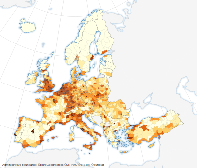
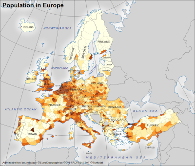
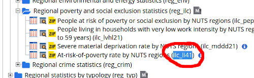
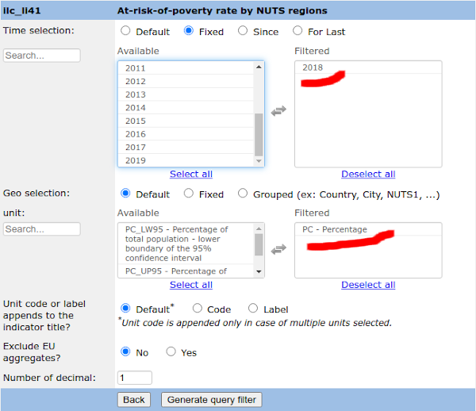
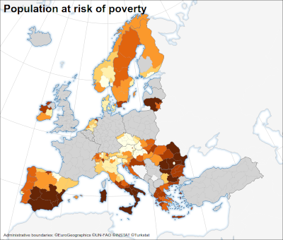

# Eurostat-map in 5 minutes

This page describes how to quickly create a statistical map with Eurostat data. It does not require any knowledge in javascript programming.

## Create a map

-   Download [**eurostat_map.html**](https://raw.githubusercontent.com/eurostat/eurostat-map/master/docs/tutos/quick/eurostat_map.html) file (with CTRL+S) on your desktop.
-   Double click on it: The map below should appear in a web browser. This is a default map showing the latest Eurostat figures on population.



## First customisation

To modify this map, edit the **eurostat_map.html** file with a text editor such as Notepad or [Notepad++](https://notepad-plus-plus.org/). For that, you can either:

-   right-click on the file, select "open with..." menu item, and select a text edition program,
-   or launch a text editor and open the file.

You should see the short code snippet defining the map:

```html
<svg id="map"></svg>
<script src="https://unpkg.com/eurostat-map@3.3.0"></script>
<script>
    eurostatmap.map('ch').build()
</script>
```

As first modifications, we propose to:

-   add a title: _Population in Europe_,
-   change the background color in light gray,
-   show place name labels.

This can be achieved by simply inserting three lines as below:

```html
<svg id="map"></svg>
<script src="https://unpkg.com/eurostat-map@3.3.0"></script>
<script>
    eurostatmap.map('ch').title('Population in Europe').seaFillStyle('lightgray').labelling(true).build()
</script>
```

To show the modified map,

1. save the file (CTRL+S),
2. re-open it (with double-click), or fresh the web browser content by pressing F5 button.

The new map appears:



For each map characteristic to change, insert a line with the **name** of the characteristic (such as `.title`) and the desired **value** (such `"Population in Europe"`).

The list of caracteristics is described in the [documentation](../../reference.md).

The most important characteristic is of course the statistical data to show on the map, as described in the next section.

### Choose the Eurostat statistics

Too show some specific Eurostat data, note the code of the corresponding database as indicated on [Eurostat website](https://ec.europa.eu/eurostat/web/main/data/database). For example, to select _data on at-risk-of-poverty population by NUTS 2 region_, note the code is **ilc_li41**.



Then use the [query builder](https://ec.europa.eu/eurostat/web/json-and-unicode-web-services/getting-started/query-builder) to specify more precisely the dataset figure to select. For our example, we will select the data for _2018_ and the unit _Percentage_.



Note that:

-   For each dimension, only one value should be selected.
-   Ignore the _geo selection_, _unit code/label_ question and _EU aggregate_ question.
-   to show the most recent figures, ignore the _time selection_.

Hit the _Generate query filter_ button to get a selection text such as:

**ilc_li41?unit=PC&precision=1&time=2018**

And insert it in the map definition following this format:

```html
<svg id="map"></svg>
<script src="https://unpkg.com/eurostat-map@3.3.0"></script>
<script>
    eurostatmap
        .map('ch')
        .title('Population at risk of poverty')
        .nutsLvl(2)
        .stat({ eurostatDatasetCode: 'ilc_li41', filters: { unit: 'PC', time: 2018 } })
        .build()
</script>
```

This new version produces the map with the desired statistics:



For more information on how to specify the map statistics (from a CSV file or region by region), see the [documentation](../../reference.md#eurostat-database).

## More customisation

Each map can be customised in many different ways. To explore the possibilities, see the [documentation](../../reference.md).

## Publish the map

To publish a map defined with eurostat-map.js, simply insert the code snippet into your HTML webpage.
